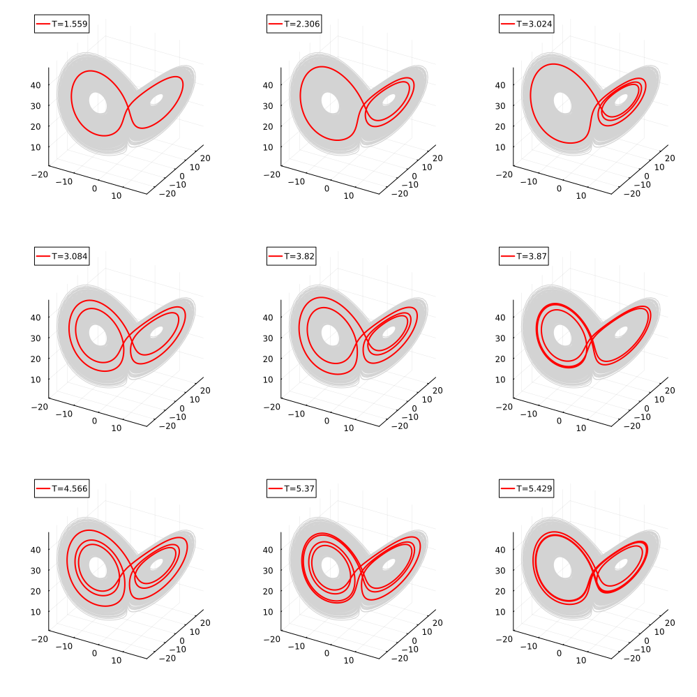

# Jupo

[](https://github.com/ushham/Jupo.jl/actions/workflows/CI.yml?query=branch%3Amain)

A julia package for numerically finding Unstable Periodic Orbits (UPOs) in dynamical systems.

This library accompanies the study currently under review:

Hamilton, O., Demaeyer, J., Crucifix, M. & Vannitsem, S. (2025) Using Unstable Periodic Orbits to Understand Blocking Behaviour in a Low Order Land-Atmosphere Model [under review] [https://arxiv.org/abs/2503.02808](https://arxiv.org/abs/2503.02808)

It is planned to improve this library and then add to [ChaosTools.jl](https://github.com/JuliaDynamics/ChaosTools.jl), see [issue 347](https://github.com/JuliaDynamics/ChaosTools.jl/issues/347).

### Examples
Here are some of the UPOs of the Lorenz 63 system:

### Usage
To find the UPOs of a given dynamical system, define a `System`, as the collection of the dynamical rule, the jacobian, and some other information about the system:
```julia
lorenz = System(
        name="Lorenz", 
        f=lorenz!, 
        jac=lorenz_j!, 
        ndim=3, 
        p=[10., 28., 8/3],
        p_names=["sig", "r", "b"]
        )
end
```

this is passed to the method of choice for finding the UPOs, along with a `Vector` containing the initial conditions and the initial period: `ic = [x_0; T]`.

```julia
upo = find_upo_nm(lorenz, ic)
```

This will produce a `UPO_sol` struct, which contains:
- success (whether the algorithm ran successfully)
- ic (initial conditions)
- period
- system (summary of system parameters)
- floquet_multipliers


Currently only the newton method finder is working. In the future the stabilising transforms method will be added.